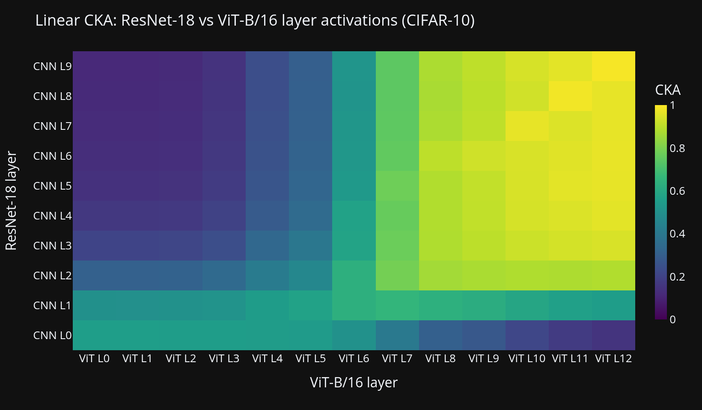
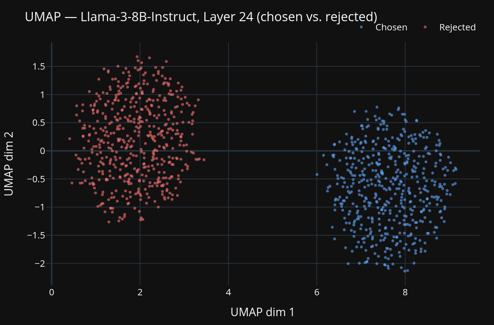

# Representational Geometry in Neural Networks
### *From Vision Transformers to RLHF-Aligned Language Models*

> *"We are not fine-tuning a model — we are performing a geometric audit of what training does to the internal state of a neural network."*

---

## Overview

This project studies how training transforms the internal representation spaces of neural networks — across two complementary settings:

**Part 1 — Vision Models:** We compare the representational geometry of CNNs and Vision Transformers on CIFAR-10, using Centered Kernel Alignment (CKA) to quantify how similarly the two architectures encode visual information, and Class Activation Maps to identify which image regions drive cluster formation.

**Part 2 — Language Models:** We investigate how Reinforcement Learning from Human Feedback (RLHF) geometrically transforms the embedding space of large language models, comparing Llama-3-8B (base) with Llama-3-8B-Instruct (RLHF-aligned) to make the alignment transformation literally visible and explorable.

Both parts are surfaced in a single **interactive Plotly Dash dashboard** with two tabs.

| Part 1 — CKA: ResNet-18 vs ViT-B/16 | Part 2 — UMAP: RLHF Embedding Space |
|:---:|:---:|
|  |  |

---

## Research Questions

| Part | Question | Method |
|------|----------|--------|
| Vision | How similar are the internal representations of CNNs vs. ViTs, and which image regions drive cluster formation? | CKA + Class Activation Maps |
| Language | Can a linear hyperplane separate preferred from rejected response vectors after RLHF, and how does this evolve across layers? | LinearSVC + Margin Analysis |
| Language | Can political or cultural biases introduced by RLHF be identified as geometric structures in the embedding space? | Bias Probes + Cluster Analysis |

---

## Datasets

- **CIFAR-10** — Standard image classification benchmark
- [`Anthropic/hh-rlhf`](https://huggingface.co/datasets/Anthropic/hh-rlhf) — Human preference pairs (chosen vs. rejected responses)
- [`OpenAssistant/oasst1`](https://huggingface.co/datasets/OpenAssistant/oasst1) — Open-source preference dataset

---

## Tech Stack

| Layer | Tool |
|-------|------|
| Vision Models | ResNet-18 + ViT-B/16 (torchvision pretrained, fine-tuned on CIFAR-10) |
| Language Models | HuggingFace Transformers (Llama-3-8B, 4-bit quantized) |
| Representational Similarity | Linear CKA, LinearSVC, TruncatedSVD |
| Dimensionality Reduction | UMAP, t-SNE |
| Visualization | Plotly Dash (unified two-tab dashboard) |

---

## Dashboard

A single Dash app (`app/app.py`) with two tabs, running on `http://127.0.0.1:8050`.

**Tab 1 — CNN vs ViT (CIFAR-10)**
- CKA heatmap: pairwise layer similarity between ResNet-18 and ViT-B/16
- CAM comparison: side-by-side Class Activation Maps with class filter dropdown

**Tab 2 — RLHF Embedding Space**
- UMAP / t-SNE scatter of chosen vs. rejected embeddings per layer
- Layer slider + model toggle (base vs. instruct)
- LinearSVC separation score line chart across all layers

### Project Structure

```
app/
  app.py                  # Unified two-tab Dash app
  callbacks.py            # Part 2 callback logic
  vision_callbacks.py     # Part 1 callback logic
  compute.py              # UMAP, t-SNE, LinearSVC fitting + pickle cache
  vision_compute.py       # Linear CKA computation + pickle cache
  figures.py              # Part 2 Plotly figure builders
  vision_figures.py       # Part 1 Plotly figure builders (CKA heatmap, CAM)
scripts/
  extract_embeddings.py        # Offline: embed hh-rlhf with Llama-3-8B, save HDF5
  extract_vision_embeddings.py # Offline: fine-tune ResNet-18 + ViT-B/16, extract activations
  generate_mock_data.py        # Synthetic LLM embeddings for UI testing
  generate_mock_vision.py      # Synthetic vision activations + CAMs for UI testing
  export_slide_figures.py      # Export static PNGs from mock data for slides
  data.py                      # hh-rlhf sampling
  io.py                        # HDF5 read/write (LLM + vision)
tests/                    # pytest test suite (24 tests)
data/
  embeddings/             # LLM HDF5 files (gitignored)
  vision/                 # Vision HDF5 files (gitignored)
  cache/                  # Projection + CKA cache (gitignored)
assets/
  slides/                 # Exported PNGs for slides (gitignored)
```

### Setup

```bash
python -m venv .venv
source .venv/bin/activate
pip install -r requirements.txt
```

### Option A — Test with mock data (no GPU required)

Generates synthetic data for both parts shaped identically to real model output:

```bash
python scripts/generate_mock_data.py
python scripts/generate_mock_vision.py
python app/app.py
```

Open [http://127.0.0.1:8050](http://127.0.0.1:8050).

First launch fits UMAP, t-SNE, LinearSVC, and CKA for all layer combinations (~5–10 min for mock data). Results are cached to `data/cache/` — subsequent launches start in seconds.

### Option B — Real embeddings (requires GPU + HF token)

**Part 1 — Vision:**

```bash
python scripts/extract_vision_embeddings.py --epochs 10 --n-train 10000
```

Trains ResNet-18 and ViT-B/16 on CIFAR-10 and extracts layer activations + GradCAM. Expects a CUDA-capable GPU. Takes ~30–60 min depending on hardware.

**Part 2 — Language:**

Models are gated on Hugging Face — request access to `meta-llama/Meta-Llama-3-8B` and `meta-llama/Meta-Llama-3-8B-Instruct` first.

```bash
export HF_TOKEN=<your_token>

python scripts/extract_embeddings.py --model meta-llama/Meta-Llama-3-8B --n-rows 500
python scripts/extract_embeddings.py --model meta-llama/Meta-Llama-3-8B-Instruct --n-rows 500
```

Extraction takes ~1–2 hours per model on an RTX 2080 Super (4-bit quantized, ~5 GB VRAM). See `SETUP.md` for full instructions.

### Run tests

```bash
pytest tests/ -v   # 24 tests
```

---

## Team

| Name | Program |
|------|------|
| Marla Huxhold | M.Sc. Data Science |
| Sarah Pollinger | M.Sc. Data Science |
| Ellen Kunigk | M.Sc. Computer Science |
| Kevin Kunkel | M.Sc. Computer Science |
| Abdellah Charki | M.Sc. Data Science |

---

## References

- Kucukahmetler et al. (2026). *Relative Geometry of Neural Forecasters: Linking Accuracy and Alignment in Learned Latent Geometry.* [arXiv:2602.15676](https://arxiv.org/abs/2602.15676)
- Kornblith et al. (2019). *Similarity of Neural Network Representations Revisited.* ICML. [arXiv:1905.00414](https://arxiv.org/abs/1905.00414)
- Ouyang et al. (2022). *Training language models to follow instructions with human feedback.* NeurIPS. [arXiv:2203.02155](https://arxiv.org/abs/2203.02155)
- Christiano et al. (2017). *Deep Reinforcement Learning from Human Preferences.* NeurIPS. [arXiv:1706.03741](https://arxiv.org/abs/1706.03741)
- McInnes et al. (2018). *UMAP: Uniform Manifold Approximation and Projection.* [arXiv:1802.03426](https://arxiv.org/abs/1802.03426)
- Dosovitskiy et al. (2020). *An Image is Worth 16×16 Words: Transformers for Image Recognition at Scale.* [arXiv:2010.11929](https://arxiv.org/abs/2010.11929)
- [Anthropic HH-RLHF Dataset](https://huggingface.co/datasets/Anthropic/hh-rlhf)

---

*Mathematics & Machine Learning Internship — University of Leipzig, SoSe 2026*
